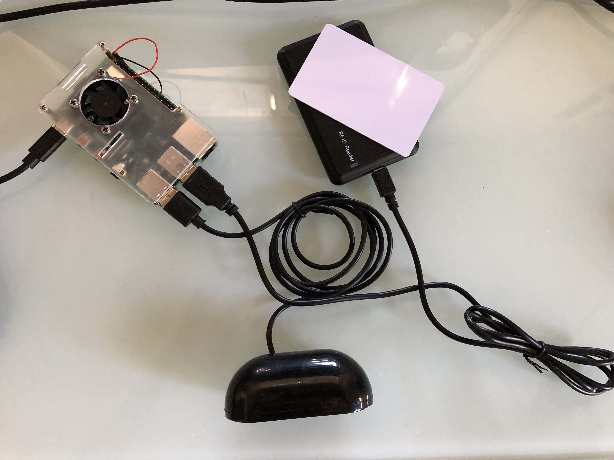

# PyJukeBox

Inspired by Toniebox but too cheap to buy one. Too much of a nerd to say I can build myself!
Could not get the installtion for [Pnoniebox](https://www.iphone-ticker.de/wochenend-projekt-kontaktlose-musikbox-fuer-kinder-123063/) to work so , bored by COVID19 lockdown here is a simple Python engine for RFID card enabled MP3 players on a Raspberry Pi.


## Requirements - Hardware and Software
Here's a list of required hardware with Amazon links that I purchased. They can vary I think, especially the Raspberry Pi and the speaker.

1. [Raspberry Pi 4](https://www.amazon.com/gp/product/B07TD42S27/ref=ppx_yo_dt_b_asin_title_o03_s00?ie=UTF8&psc=1)
2. [RFID Reader](https://www.amazon.com/gp/product/B07TMNZPXK/ref=ppx_yo_dt_b_asin_title_o03_s01?ie=UTF8&psc=1)
3. [USB Speaker](https://www.amazon.com/gp/product/B075M7FHM1/ref=ppx_yo_dt_b_asin_title_o03_s00?ie=UTF8&psc=1) I was reading the 3.5 Rasbperry output usuall had a hum, so I opeted for the digital USB speaker solution.
4. [MicroSD](https://www.amazon.com/gp/product/B073JWXGNT/ref=ppx_yo_dt_b_asin_title_o03_s01?ie=UTF8&psc=1)
5. [PI Cover](https://www.amazon.com/gp/product/B07TTRHZF9/ref=ppx_yo_dt_b_asin_title_o04_s00?ie=UTF8&psc=1)
6. [RFID Cards](https://www.amazon.com/gp/product/B07DPFPQ49/ref=ppx_yo_dt_b_asin_title_o03_s02?ie=UTF8&psc=1) , I think you can also use RFID FOBs ans attache them to stuffed animals.
7. A box / container for the final Jukebox. We used a old gift box because of COVID19 lockdown, but planned to go through antigque shops for nicer solutions.

RFID cards allow to customize the cards in any way you like.


## Setup
Download the headless [Rasbian Buster](https://www.raspberrypi.org/downloads/raspbian/) release and follow the instructions how to [flash the iso](https://www.raspberrypi.org/downloads/raspbian/) onto the MicroSD card. On a Mac, Etcher ran without any issue.

Next, enable Wifi connectivity on installed operating system.

Run `touch /Volumes/boot/ssh` to enable `ssh` on the headless Rasbian.

Copy 
```
country=US
ctrl_interface=DIR=/var/run/wpa_supplicant GROUP=netdev
update_config=1

network={
    ssid="NETWORK_ID"
    psk="PASSWORD"
}
```

into 
```
/Volumes/boot/wpa_supplicant.conf
```
*(Note, the above path is for Macs, the mounted MicroSD might be in a different location if you are on Windows or Linux)*

The Rapsberry with the now configured MicroSD should now be accessible through the your Wifi. 
Now, connect through `ssh pi@REPLACE_PI_IP_HERE`.


Now, on the PI install the dependencies
```
sudo apt install vim
sudo apt install ipython3
sudo apt install python3-pip
sudo apt install evtest
sudo pip3 install evdev
sudo pip3 install python-vlc
```

## How to determine device path for USB RFID reader

Run `evtest` and `lsusb`. If no other USB device is plugged to the PI, `evtest` will output the RFID device path.

## Setup Media db
Create a JSON file of the format 
```
{
    "RFID_CODE" : "/path/to/a/audio/file.mp3"
}
```

## Start JukeBox
```
<install_path>/jukebox.py --db <your_db>.jdbd -i /dev/event/rfid_reader_id
```
